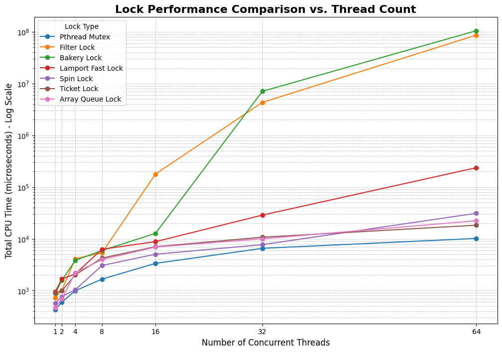

# Hardware and Software Locking Strategies for Synchronization

## Machine Specifications
The program was tested on the IITK CSEWS machine in the KD Lab. The relevant hardware specifications are as follows:

- **Architecture:** x86\_64  
- **CPU(s):** 12  
- **Thread(s) per core:** 2  
- **Core(s) per socket:** 6  
- **Socket(s):** 1  
- **NUMA node(s):** 1  

## Implementation Overview

### Following locks are implemented
1. Pthread Mutex (baseline)  
2. Filter Lock  
3. Bakery Lock  
4. Lamport Fast Lock  
5. Spin Lock  
6. Ticket Lock  
7. Array-based Queue Lock  

### x86-64 architecture primitives and memory ordering
Hardware atomics and memory barriers are used rather than C++ library mutexes for synchronization purposes.  
- CAS/atomic RMW: `lock cmpxchg` / `lock xadd` to implement compare-and-swap, fetch-and-add, etc.  
- Full memory fence: `mfence` to avoid store->load reordering on x86-64 machine when needed by the algorithm.  
- Spin-wait hint: `pause` to reduce inter-core contention while polling.  
- False sharing avoidance: per-thread arrays were cache-line padded so that each frequently-written slot resided in its own cache line.  

### Modification to the original code
- **Flawed time measurement:**  
  The earlier implementation summed the individual execution times of each thread rather than measuring the total wall-clock time from the start of the parallel section to the end. We originally summed per-thread durations into `sync_time`, producing the sum of wall-clock times across threads (e.g., 4 threads × 100 ms each → 400 ms), which incorrectly reports CPU-time rather than wall-clock runtime. This was modified to measure the total wall-clock time of the parallel region (barrier from start, join after completion) and report microseconds.  

- **Memory leaks:**  
  The original code allocated new lock objects via `new` for each test without freeing the memory with `delete`. This was corrected in the final implementation to ensure proper resource management.  

- **Reduced number of operations per thread:**  
  The original code was configured to execute $10^6$ operations per thread. During testing, it was observed that even with 16 threads, some lock execution times became excessively large, and it was unclear when they would finish. To ensure timely completion and practical evaluation of results, the number of operations per thread was reduced to $10^3$.  

---

### Results and Observations

**Execution time (in microseconds) for different locks under varying thread counts**

| **Lock Type**        | **1** | **2** | **4** | **8** | **16** | **32**   | **64**     |
|-----------------------|-------|-------|-------|-------|--------|----------|------------|
| Pthread Mutex         | 428   | 595   | 989   | 1658  | 3341   | 6531     | 10142      |
| Filter Lock           | 724   | 1016  | 4114  | 5365  | 178229 | 4325930  | 86308917   |
| Bakery Lock           | 876   | 1576  | 3825  | 5922  | 12711  | 7086574  | 105011496  |
| Lamport Fast Lock     | 950   | 1668  | 2094  | 6267  | 8793   | 28641    | 236331     |
| Spin Lock             | 568   | 764   | 1032  | 3043  | 5025   | 7687     | 31043      |
| Ticket Lock           | 896   | 986   | 2004  | 4228  | 7023   | 10717    | 18269      |
| Array Queue Lock      | 460   | 692   | 2212  | 3958  | 6916   | 9967     | 22308      |

---

### Extended Observations for Larger Workloads

While the above table shows performance at $N = 10^3$, I also tested larger workloads to understand scalability under heavy contention.

#### At 16 threads and N = 10^5:
- Pthread mutex completed in 29382 us.  
- Spin lock degraded significantly, taking 117173 us due to excessive spinning and cache-line invalidations.  
- Ticket lock and Array queue lock both slowed dramatically, each requiring approx 45 minutes.  
- Filter and Bakery locks gave the worst performance, requiring more than an hour.  

#### At 64 threads and N = 10^6:
- Pthread mutex still completed in 5677345 us (5.6 s).  
- Spin lock ballooned to 109456881 us (109 s).  
- Ticket, Array queue, Filter, and Bakery locks all took impractically long (hours), highlighting their sensitivity to OS scheduling and cache contention.  

---

## Analysis
1. 1 socket, 6 physical cores × 2 SMT = 12 hardware threads. Running up to 64 software threads means significant oversubscription and OS scheduling/preemption. Oversubscription increases variability and queueing delay inside locks, especially those with O(N) admission (Filter/Bakery).  

2. **Pthread Mutex (Baseline)** exhibited predictable, near-linear scaling across threads. Performance stability is due to OS integration — the scheduler blocks threads instead of spinning wastefully. At 64 threads and N = 1e5, it still scales better than most custom locks.  

3. **Ticket Lock** performance was close to pthread, with slightly higher overhead at higher threads. FIFO ordering ensures fairness and prevents starvation. The `pause` instruction during busy-waiting reduced contention on the memory system. But for a higher number of operations (N=1e5 and T=16), the ticket lock took nearly 45 minutes, highlighting the fundamental cost of spinning.  

4. **Array Queue Lock** performed comparably, leveraging its cache-friendly design where each thread spins on a unique, local memory location. However, performance degraded beyond 32 threads. At 64 threads, queue management overhead and oversubscription caused large delays. Similar to ticket lock, stress testing on N=1e5 and T=16, it took nearly 45 minutes.  

5. **Spin Lock** is among the fastest for low contention (1–8 threads). Degraded under heavy contention due to cache-line invalidations caused by all threads hammering on the same lock variable, but still significantly better than others. Even for an efficient spin-lock, executing the spin-wait loop 100000 times per thread under contention consumes a colossal amount of CPU resources compared to the pthread strategy of simply going to sleep. This demonstrates that for workloads with very high lock acquisition frequency, a sleeping lock is vastly superior to a spinning lock, regardless of how well-designed the spin-lock is.  

6. **Filter and Bakery Locks** collapsed catastrophically beyond 16 threads. Both have O(N) admission complexity and require multiple memory operations per acquire/release. Highly sensitive to OS preemption: if a lock-holder thread is descheduled, all others spin uselessly. Result: exponential explosion in CPU time.  

7. **Lamport Fast Lock** performed better than Filter and Bakery at moderate thread counts but ultimately suffered from the same scalability issues under high contention, confirming that software-only designs struggle to compete with their hardware-assisted counterparts.  
